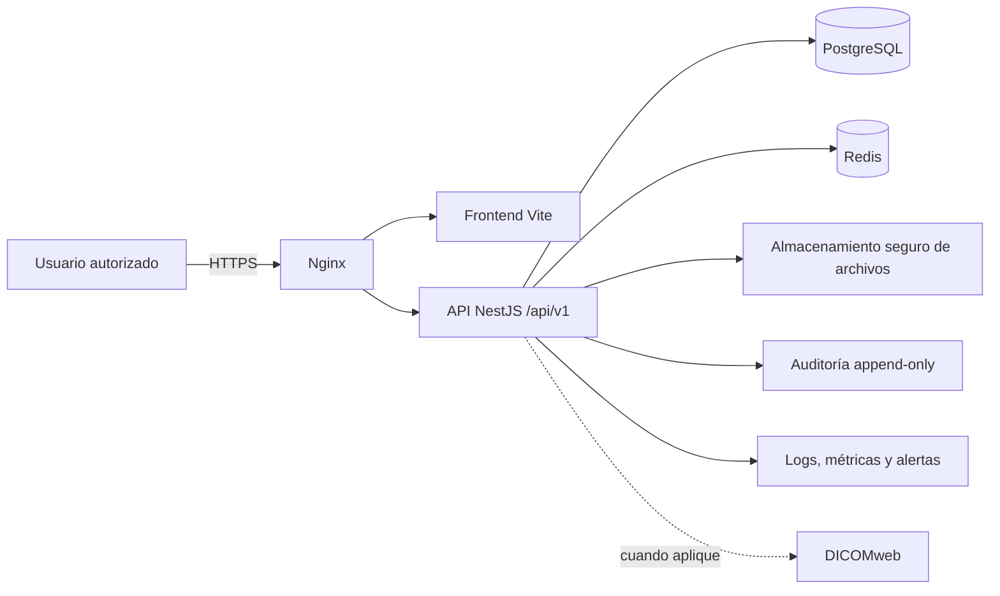

# Plataforma de Consulta Médica

## Estado del proyecto

La plataforma está en desarrollo y **no está autorizada para procesar datos clínicos reales**. El repositorio ya contiene un frontend Vite y una primera implementación de API NestJS, pero aún no cumple los requisitos de seguridad, auditoría, migraciones y operación necesarios para producción.

Este README es la guía rectora de arquitectura, compatibilidad y fases de trabajo. Si un plan, diagrama o documento externo discrepa, prevalece este documento, seguido por OpenAPI, las migraciones versionadas y las pruebas.

## Arquitectura actual

| Área | Estado actual |
|---|---|
| Frontend | Vite 5, HTML, CSS y JavaScript ES Modules, con router hash y módulos existentes en `src/js/`. |
| Cliente de datos | `src/js/services/dataService.js` consume la API bajo `/api/v1`; el access token vive solo en memoria y el refresh token en una cookie `HttpOnly`. |
| API | NestJS + TypeScript en `server/`. TypeORM es el ORM seleccionado. |
| Persistencia | PostgreSQL mediante TypeORM. El esquema se crea con migraciones versionadas y `synchronize: false`. |
| Caché/sesiones | PostgreSQL es la fuente de verdad de sesiones revocables y refresh tokens rotativos. Redis, cuando se habilita, distribuye los límites de login y la caché de revocación. |
| Contenedores | `docker-compose.yml` inicia PostgreSQL y Redis para desarrollo local; todavía no contiene servicios de API, frontend ni Nginx. |
| Documentos | El backend usa almacenamiento local temporal en `uploads/`; no es almacenamiento clínico de producción. |

## Decisiones de compatibilidad

- El producto es una única aplicación web. No se crearán APK ni clientes móviles independientes.
- Se conserva Vite, HTML, CSS y JavaScript ES Modules. No se incorpora React, Vue, Angular ni otro framework sin una decisión arquitectónica documentada.
- Se conserva el hash router durante la migración inicial. Un cambio a history router requiere una tarea separada, configuración de Nginx y pruebas de rutas directas.
- NestJS es la única puerta de acceso a datos clínicos. PostgreSQL es la fuente transaccional de verdad; Redis es auxiliar.
- TypeORM es el único ORM del proyecto. No se añadirá Prisma.
- Los JSON de `src/data/` son referencia de dominio, fixtures o seeds; no son fuente de verdad ni persistencia de producción.
- IndexedDB y `localStorage` no pueden almacenar datos clínicos, contraseñas ni tokens sensibles. Se retiran solo después de migrar todos sus consumidores.
- Los identificadores los genera el servidor; las fechas se almacenan como `timestamptz`; las operaciones clínicas relacionadas usan transacciones.
- Los registros clínicos y documentos se eliminan mediante baja lógica, incluso cuando el contrato exponga `DELETE`.

## API implementada hoy

El prefijo global es `/api/v1`. Los recursos existentes conservan los nombres del dominio del frontend:

- `POST /auth/login`, `POST /auth/register` (solicitud de médico), `POST /auth/refresh`, `POST /auth/logout` y `GET /auth/me`
- Administración protegida: `GET`/`POST`/`PATCH /usuarios`, `GET /usuarios/roles` y `GET /auditoria`
- Lectura de `/medicos` y edición/activación de perfiles médicos mediante `PATCH /medicos/:id` para quien posee `usuarios:gestionar`
- CRUD de `/pacientes`, `/citas`, `/consultas`, `/recetas` y `/estudios` con validación de referencias y autoría médica
- Indicadores agregados protegidos: `GET /indicadores/dashboard` y `GET /indicadores/reportes`
- Documentos protegidos: `POST /documentos` (multipart), `GET /documentos?pacienteId=<uuid>`, `GET /documentos/:id/download`, enlace temporal en `POST /documentos/:id/enlace-descarga`, `PATCH /documentos/:id`, restauración y baja lógica
- Catálogos clínicos persistentes: `GET /catalogos`, `GET /catalogos/:tipo` y administración protegida en `/catalogos/entradas`

La existencia de un endpoint no significa que esté listo para producción. La primera entrega de identidad ya incluye usuarios, roles, permisos, sesiones revocables, límites de login, expiración por inactividad, detección de reutilización de refresh token, administración básica y auditoría append-only. `pacientes`, `citas`, `consultas`, `recetas`, `estudios`, `medicos` y `documentos` cuentan con pruebas de integración (`npm run test:e2e`); el contrato OpenAPI de documentos y los controles operativos de producción quedan pendientes.

### Listados de Fase 3

- `GET /pacientes?page=1&limit=50&q=ana&estado=activo` devuelve `{ items, pagination }`. `q` busca nombre, apellidos, identificador, CURP y NSS. `limit` admite de 1 a 100.
- `GET /citas?page=1&limit=50&fecha=YYYY-MM-DD&medicoId=<uuid>&pacienteId=<uuid>&consultorioId=<texto>&estado=<estado>` devuelve `{ items, pagination }`. También acepta `fechaDesde` y `fechaHasta` cuando no se consulta una fecha puntual.
- El cliente conserva `getAll()` para recursos que aún devuelven arreglos y ofrece `getPage()` para los listados paginados. Esto evita romper módulos heredados durante la migración.
- Al crear o modificar una cita, el backend valida médico y paciente activos, el intervalo horario, los cambios de estado y los solapes de médico o consultorio. Un solape devuelve `409 Conflict`; una transición inválida devuelve `400 Bad Request`.

### Núcleo clínico de Fase 4

- `GET /consultas?pacienteId=<uuid>`, `GET /recetas?pacienteId=<uuid>` y `GET /estudios?pacienteId=<uuid>` exigen `pacienteId`; omitirlo devuelve `400` en vez de todos los registros.
- Crear o modificar una consulta, receta o estudio exige que `medicoId` coincida con el médico de la sesión autenticada; si no coincide, devuelve `403`.
- `PATCH /consultas/:id` con `{ "estado": "completada" }` cierra la consulta en una transacción con bloqueo; cualquier `PATCH` posterior sobre una consulta `completada` devuelve `400`.
- `POST /recetas` ignora cualquier `folio` que envíe el cliente; el servidor lo asigna a partir de la secuencia `recetas_folio_seq`.
- Las vistas globales consumen indicadores agregados en vez de descargar consultas, recetas o estudios completos. Los dos endpoints de indicadores requieren los permisos de lectura de pacientes, citas y recursos clínicos.

## Bloqueantes actuales de producción

Antes de conectar datos reales se debe resolver lo siguiente:

- Sustituir la cuenta sintética de desarrollo por usuarios administrados y revisados antes de cualquier entorno no local.
- Eliminar los valores por defecto de base de datos y JWT; las credenciales se obtienen exclusivamente desde variables de entorno.
- Mantener y revisar las migraciones TypeORM versionadas antes de cada cambio de esquema.
- Habilitar Redis obligatorio fuera de desarrollo y definir una política revisada de duración de sesión por inactividad.
- Configurar `REFRESH_COOKIE_SECURE=true`, HTTPS y CSRF antes de desplegar cookies fuera de localhost.
- Revisar periódicamente la integridad y retención de la auditoría append-only.
- Reemplazar el directorio local `uploads/` por almacenamiento seguro de objetos, validación de tipo/tamaño y URLs de descarga autorizadas.
- Añadir Dockerfiles, Nginx, HTTPS, CORS restringido, CSRF cuando se usen cookies, respaldos, monitoreo y CI/CD.

## Arquitectura objetivo



## Reglas de seguridad y datos

- El backend valida todos los DTO, permisos y reglas de negocio; los controles visuales del frontend no son seguridad.
- El frontend no hace fallback silencioso a JSON, IndexedDB o `localStorage` si una operación de API falla.
- No se registran expedientes, contraseñas, tokens o datos clínicos en consola ni logs.
- Cada escritura clínica y cada lectura de expediente generan un evento de auditoría con usuario, rol, acción, recurso, resultado, fecha y correlation ID. Health checks y archivos estáticos se excluyen.
- Los binarios no se almacenan en la base de datos ni en el navegador; PostgreSQL conserva metadatos, relaciones, estado y permisos.

## Fases de implementación

Las fases se entregan en cortes verticales: contrato OpenAPI → migración → endpoint validado/autorizado/auditado → pruebas backend → módulo frontend → pruebas extremo a extremo. Una fase no se considera terminada solo porque su código exista.

### Fase 0 — Estabilización e inventario

- Verificar build de frontend y backend, estado de Git y módulos consumidores de `dataService.js`, `storage.js` y utilidades con almacenamiento local.
- Sacar del índice los artefactos generados ya versionados (`node_modules/` y `dist/`) y confirmar `.gitignore`.
- Crear `server/.env.example`, eliminar secretos/valores por defecto de código y Docker Compose, y añadir `server/package-lock.json`.

**Salida:** instalación reproducible, secretos fuera del repositorio e inventario de dependencias heredadas.

### Fase 1 — Base de datos e infraestructura de desarrollo

- Mantener migraciones TypeORM, restricciones e `timestamptz`; la primera migración del esquema ya está aplicada localmente.
- Configurar variables de entorno, health check y logs seguros; quedan pendientes los contenedores para API y frontend.
- Mantener PostgreSQL y Redis solo como dependencias de desarrollo hasta completar controles de seguridad.

**Salida:** una base vacía migra desde cero, cuenta con health check en `GET /api/v1/health`, datos sintéticos opcionales para desarrollo y no depende de credenciales incorporadas al código.

### Fase 2 — Identidad, permisos y auditoría

- Se implementaron usuarios asociados opcionalmente a médicos, roles `ADMIN`/`MEDICO`/`ASISTENTE`, permisos granulares y guardas sobre los recursos clínicos.
- Se implementaron login, refresh rotativo, logout, `/auth/me`, sesiones revocables en PostgreSQL y cookie `HttpOnly` para refresh. El access token reside únicamente en memoria.
- Se agregó pantalla de login, restauración de sesión, guardas de rutas y cierre de sesión en la barra lateral.
- La bitácora registra autenticación y lecturas/escrituras protegidas; PostgreSQL impide `UPDATE` y `DELETE` sobre `auditoria` mediante trigger.
- Redis limita los intentos fallidos por identidad seudonimizada mediante HMAC y replica la revocación de sesión. Si está apagado en desarrollo, existe una reserva local; en un entorno compartido debe configurarse `REDIS_ENABLED=true` y `REDIS_REQUIRED=true`.
- El rol con `usuarios:gestionar` puede abrir `#/administracion`, crear usuarios, asignar los roles existentes, activar/desactivar cuentas y reiniciar contraseñas. El backend conserva al menos un administrador activo y revoca sesiones al desactivar o restablecer una contraseña.
- El registro público solo acepta solicitudes de médicos: crea el perfil y la cuenta con rol `MEDICO` en estado `pendiente`. Un gestor debe revisar y activar el perfil en `#/administracion`; esa acción activa la cuenta asociada y, al desactivarla, revoca sus sesiones.
- Solo puede existir una cuenta con rol `ADMIN`. La API impide asignar un segundo administrador y PostgreSQL aplica la misma regla mediante un trigger sobre `usuario_roles`. El formulario de administración no ofrece crear ni asignar administradores.
- Los rechazos de permisos quedan auditados como `authorization.denied`, sin registrar cuerpos ni datos clínicos. Cada refresh se consume una sola vez: su reutilización revoca la sesión, registra `auth.refresh_reuse` y propaga la revocación a Redis.
- La sesión conserva un vencimiento absoluto y uno configurable por inactividad (`SESSION_IDLE_TTL_MINUTES`, 60 minutos en desarrollo). Al vencer, se revoca en PostgreSQL y Redis y registra `auth.session_idle_timeout`.
- Pendiente en esta fase: políticas operativas de retención y revisión de auditoría.

**Salida actual:** ninguna ruta protegida se monta sin sesión; `401` redirige a login, `403` se presenta como acceso denegado y las acciones protegidas quedan auditadas.

### Fase 3 — Pacientes y agenda

- Implementado: `/pacientes` y `/citas` admiten paginación, filtros y búsqueda autorizada desde el backend; la interfaz de Pacientes y Agenda los consume directamente.
- Implementado: las consultas de agenda traen médico y paciente asociados, por lo que se eliminaron lecturas adicionales por cada cita. La fecha inicial de Agenda ya usa el día local y el filtro por paciente se aplica antes de cargar la vista.
- Implementado: la creación y edición de citas se ejecutan en una transacción, toman bloqueos transaccionales de PostgreSQL por médico/fecha y consultorio/fecha, rechazan solapes con `409` y validan las transiciones `pendiente → confirmada → en_consulta → completada` o cancelación desde los estados no finales.
- Implementado: contrato OpenAPI de `/pacientes` y `/citas` servido en `GET /api/docs` (deshabilitado cuando `NODE_ENV=production`).
- Implementado: pruebas automatizadas de integración (`npm run test:e2e` en `server/`) contra una base PostgreSQL de pruebas real y aislada, cubriendo paginación, búsqueda, filtros, solapes (`409`), transiciones de estado (`400`) y autorización (`401`/`403`) de `pacientes` y `citas`.
- Pendiente: extender el contrato OpenAPI y las pruebas automatizadas a `documentos` cuando reciba su propio corte funcional.

**Salida verificada:** buscar paciente, filtrar la agenda y rechazar un solape o transición inválida funciona contra la base local autenticada, y queda cubierto por pruebas automatizadas repetibles. Falta la navegación visual de extremo a extremo (Playwright u otra herramienta de UI), que se abordará junto con el resto de los módulos clínicos.

### Fase 4 — Núcleo clínico

- Implementado: nuevo `GET /medicos` y `GET /medicos/:id` (solo lectura, protegidos con sesión). No existía ningún endpoint de médicos; el frontend ya lo necesitaba (selector de médico en Agenda, nombre/cédula en Consulta, Recetas e Historia Clínica) y devolvía `404`.
- Implementado: `consultas`, `recetas` y `estudios` validan que el paciente y el médico referenciados existan y estén `activo` (mismo patrón que `citas`), y exigen `pacienteId`/`medicoId` como UUID.
- Implementado: `GET /consultas`, `GET /recetas` y `GET /estudios` ahora exigen `pacienteId` como UUID; antes, omitirlo devolvía los registros clínicos de todos los pacientes en vez de rechazar la petición.
- Implementado: la escritura de consultas, recetas y estudios queda restringida al médico autor (`medicoId` debe coincidir con el médico de la sesión autenticada, sin excepción para ADMIN); solo se puede crear o modificar el propio registro.
- Implementado: cerrar una consulta (`en_curso → completada`) es una transacción con bloqueo pesimista; una vez `completada`, el registro es inmutable y cualquier intento de modificarlo devuelve `400`.
- Implementado: el folio de las recetas (columna única) ya no lo genera el cliente — lo asigna el servidor con una secuencia de PostgreSQL (`recetas_folio_seq`) dentro de la misma transacción, eliminando la condición de carrera del cálculo anterior en el frontend.
- Implementado: contrato OpenAPI y pruebas de integración (`npm run test:e2e`) para `medicos`, `consultas`, `recetas` y `estudios`, cubriendo referencias inválidas (`400`), autoría (`403`) y el cierre transaccional de consultas.
- Corregido en el frontend: `consulta.js` y `recetas.js` usaban un médico fijo de una maqueta previa a la migración (`MED-0001`) en vez del médico de la sesión real; `recetas.js` además tenía varias llamadas a la API sin `await` que rompían la tabla y el detalle de receta, y calculaba el folio en el cliente contando registros (rompía con el primer borrado o con dos usuarios guardando a la vez).
- Corregido: las pantallas de expediente consultan consultas, recetas y estudios con `pacienteId`; Dashboard y Reportes usan `/indicadores/*`, por lo que no vuelven a descargar registros clínicos completos para calcular gráficas.
- Implementado: los signos vitales, antecedentes, diagnósticos CIE-10 y planes terapéuticos ahora tienen límites, tipos y validación anidada. El servidor calcula el IMC desde peso y talla y rechaza códigos CIE-10 inexistentes o inactivos.
- Implementado: las recetas validan medicamentos estructurados, vigencia y vías de administración. La firma se compone exclusivamente en el servidor con los datos del médico autenticado; el cliente no puede suplantarla. Las recetas y los estudios aplican transiciones de estado y no permiten cambiar paciente o médico después de su emisión.
- Implementado: `catalogos_clinicos` es una tabla versionada mediante migración, precargada con los diccionarios que usaba la interfaz. `catalogos:leer` permite consumir solo entradas activas; `catalogos:gestionar` permite crear, editar, activar o desactivar entradas desde `#/administracion`. La migración también normaliza los registros de demostración heredados al contrato clínico actual.
- Verificado: la suite de integración cubre catálogos, estructura clínica, firma de receta, transiciones y el registro/activación de médicos; suma 40 pruebas contra PostgreSQL aislado.

**Salida verificada:** crear y cerrar una consulta, prescribir una receta con folio y firma de servidor, solicitar y completar un estudio, y administrar catálogos funciona de extremo a extremo contra la base local autenticada. Las reglas de autoría, validación y transición están cubiertas por pruebas automatizadas. La automatización visual de navegador (Playwright u otra herramienta de UI) queda como mejora de una fase posterior.

### Fase 5 — Documentos e imágenes

- Implementado: las cargas se reciben como `multipart/form-data`, se validan por tamaño (10 MB configurable), tipo MIME, extensión y firma básica para PDF e imágenes. El archivo se guarda fuera de la base con nombre UUID, permisos restringidos y checksum SHA-256; la base conserva únicamente metadatos y una llave interna no expuesta por la API.
- Implementado: existe una integración configurable con antivirus por comando. En desarrollo puede quedar desactivada y el documento queda marcado como `no_configurado`; en producción el sistema rechaza cargas y descargas si no existe un escáner configurado que las apruebe.
- Implementado: los documentos se consultan obligatoriamente por paciente, se descargan mediante una ruta autenticada con `documentos:leer` y pueden usar enlaces firmados de duración configurable (cinco minutos por defecto). La descarga firmada registra el usuario que la emitió, sin incluir el token en la auditoría.
- Implementado: las bajas son lógicas, conservan responsable y fecha, y se pueden restaurar mediante `PATCH /documentos/:id/restaurar`. Las cargas, lecturas, descargas, ediciones, restauraciones y bajas quedan cubiertas por auditoría.
- Implementado: la pantalla de Imágenes / Documentos carga mediante la API y deja de conservar blobs clínicos en memoria/localStorage.
- Pendiente antes de producción: seleccionar/configurar almacenamiento de objetos y el comando antivirus de la infraestructura, definir la política de purga posterior al período de retención, DICOMweb y pruebas visuales automatizadas.
- Integrar DICOMweb únicamente cuando exista un flujo clínico y servidor aprobados.

**Salida actual:** ningún documento cargado se guarda en el navegador; el almacenamiento local es exclusivo de desarrollo y no está autorizado para producción.

### Fase 6 — Retiro de persistencia local

- Implementado: las preferencias de interfaz, notas, recordatorios, plantillas y favoritos ahora pertenecen a la cuenta autenticada y se sincronizan mediante `GET/PATCH /preferencias`.
- Implementado: las firmas se guardan como PNG protegidos fuera de la base de datos, con checksum, validación de tipo/tamaño (1 MB), análisis antivirus configurable, límite de 12 por usuario y controles de propiedad. Ninguna clave interna de almacenamiento se expone por la API.
- Implementado: restablecer Herramientas elimina los datos personales y firmas del usuario, sin afectar información clínica ni la configuración de otras cuentas.
- Retirado: no quedan imports runtime de JSON, IndexedDB, `storage.js`, `localStorage`, exportación/importación de demo ni reinicios locales de datos.

**Salida verificada:** ningún módulo funcional o clínico depende de persistencia local; los datos auxiliares que requieren sincronización son privados por usuario y están cubiertos por autenticación, auditoría y pruebas de integración.

### Fase 7 — Estabilización funcional, entorno visual y despliegue

> **Condición de entrada:** esta fase no inicia el despliegue a producción. Primero se corrigen los fallos reproducibles y se homogeneiza la interfaz mostrada en el entorno de diseño.

#### Fase 7.1 — Corrección de carga y contexto clínico

- Corregir el error reproducible en `#/pacientes`: la lista de pacientes no debe requerir un identificador de paciente ni reutilizar un contexto inválido de expediente. El listado, búsqueda, alta y navegación al expediente deben funcionar por separado.
- Revisar Historia Clínica, consultas, recetas, estudios e Imágenes / Documentos para que cada pantalla declare de forma explícita si necesita un paciente seleccionado. Cuando falte, debe mostrar una guía accionable para seleccionarlo, nunca un error técnico o una sección vacía.
- Corregir el fallo de carga visible en Herramientas > Calendario y revisar los módulos asíncronos de Herramientas para que esperen los datos de la API antes de iterarlos o dibujarlos.
- Unificar los estados de carga, vacío, error y reintento; conservar el mensaje técnico solo en consola/auditoría y mostrar al usuario una explicación clara.

**Salida:** Pacientes, Historia Clínica, Documentos y Herramientas cargan sin errores de contexto ni pantallas bloqueadas.

**Avance actual:** corregido el bloqueo de Pacientes causado por consultar documentos sin `pacienteId`, el Calendario que intentaba usar las citas antes de recibir la respuesta de la API y las rutas sin paciente válido de Historia Clínica e Imágenes / Documentos. Falta la comprobación visual manual con una sesión autenticada antes de marcar la subfase como aceptada.

#### Fase 7.2 — Flujo clínico de Imágenes / Documentos

- Rediseñar el selector de paciente y el formulario de carga con etiquetas, ayuda, validación visible, estados deshabilitados y mensajes de resultado consistentes.
- Mantener el requisito de asociar toda carga a un paciente, pero permitir buscarlo y seleccionarlo sin abandonar el módulo.
- Mejorar la lista de documentos: estado vacío informativo, metadatos legibles, acciones de descarga/edición/restauración y retroalimentación de carga o error.
- Validar visual y funcionalmente los tipos de archivo, tamaño máximo y errores del backend.

**Salida:** un médico puede seleccionar un paciente, cargar, consultar y descargar documentos sin ambigüedad visual.

**Avance actual:** el selector y formulario de carga ya usan la jerarquía visual del sistema, permiten buscar pacientes, validan el contexto, el tipo y el tamaño del archivo antes de activar la carga y explican los estados iniciales. La lista separa documentos activos y archivados; los archivados quedan retenidos para trazabilidad y se pueden restaurar mediante la API con los mismos permisos clínicos. La clase compartida `form-input` también hereda el estilo moderno de los campos del sistema, por lo que Administración deja de mostrar controles nativos sin formato. Falta la revisión visual autenticada antes de aceptar la subfase.

#### Fase 7.3 — Contratos de persistencia y respuesta de guardado

- Inventariar cada acción que crea, edita, elimina, archiva o restaura datos y comprobar la cadena completa: formulario → payload del frontend → ruta, permisos y DTO de la API → entidad, migración y consulta de lectura.
- Corregir el alta de pacientes para enviar únicamente campos admitidos por `CreatePacienteDto`; no cerrar el modal ni navegar hasta que la API confirme la creación. Los campos generados por la base (`id`, fecha de registro y estado por defecto) no deben enviarse desde el navegador.
- Resolver Referencias / Interconsultas con un modelo persistente y migración propios, o retirar temporalmente la acción de guardado. No se deben enviar propiedades que no existan en el DTO y en la entidad de `Paciente`.
- Corregir todas las consultas de documentos del expediente para incluir `pacienteId` en la API, en particular Dashboard, Documentos e Imágenes médicas; los filtros en navegador no sustituyen el contexto obligatorio del backend.
- Estandarizar los guardados: botón bloqueado durante la petición, mensaje de progreso, error visible y accesible, preservación de los valores del formulario y confirmación solo después de una respuesta exitosa. Ninguna excepción de red, validación o permisos debe quedar únicamente en la consola.
- Añadir pruebas de integración para altas y actualizaciones de cada módulo, incluyendo payload inválido, permiso insuficiente, error de red simulado y comprobación de persistencia después de recargar la vista.

**Hallazgos iniciales:** el formulario Nuevo paciente envía `foto`, `referencias`, `estado` y `fechaRegistro`, pero la API usa `ValidationPipe` con `forbidNonWhitelisted: true` y esos campos no pertenecen a `CreatePacienteDto`; por ello la petición se rechaza. El manejador no tiene `try/catch`, por lo que el usuario no recibe el motivo. Referencias repite el problema con `referencias`, una propiedad que tampoco existe en la entidad `Paciente`.

**Salida:** cada operación de guardado confirma la persistencia o explica claramente por qué no se realizó; no quedan módulos que simulen éxito, oculten una excepción o dependan de campos fuera de contrato.

**Avance actual:** implementado el contrato de alta de pacientes compatible con la API, con error visible y sin cerrar el modal hasta recibir confirmación. Referencias / Interconsultas ahora usa el recurso persistente `/referencias`, respaldado por la migración `1785340000000-ClinicalReferences`, permisos de pacientes, validación de paciente activo y auditoría global. Dashboard, Documentos e Imágenes médicas del expediente ya envían el `pacienteId` obligatorio al consultar archivos. También se añadieron pruebas de integración para altas de pacientes, referencias y permisos; la regresión completa termina con 12 suites y 47 pruebas aprobadas. Falta la revisión visual manual autenticada antes de aceptar formalmente la subfase.

#### Fase 7.4 — Compatibilidad de payloads clínicos anidados

- Inventariar y comparar los datos anidados que generan los formularios clínicos con sus DTOs: signos vitales, antecedentes, diagnósticos, medicamentos, interacciones, estudios, preferencias y metadatos de documentos.
- Establecer una sola responsabilidad para los valores derivados. El navegador puede mostrarlos, pero no debe enviar campos calculados o administrados por el servidor, como el IMC cuando el backend ya lo normaliza.
- Omitir campos opcionales vacíos en lugar de enviar cadenas vacías, `null` o tipos incompatibles que fallen validación anidada. Convertir números, fechas y listas de manera explícita antes de realizar la solicitud.
- Crear adaptadores de payload reutilizables por módulo, con tipos/documentación alineados al contrato OpenAPI y sin duplicar estructuras de DTO en cada vista.
- Homogeneizar la respuesta de validación de formularios clínicos: resaltar el grupo con error, conservar la información capturada, describir el campo rechazado en lenguaje claro y no navegar hasta obtener confirmación.
- Añadir pruebas de contrato para cada payload anidado, cubriendo valores permitidos, omisiones válidas, tipos inválidos y propiedades no permitidas por `ValidationPipe`.

**Hallazgos iniciales:** Consulta médica envía `signosVitales.imc`, aunque `SignosVitalesDto` no lo admite y `ConsultasService` lo calcula internamente; por ello aparece el error `signosVitales.property imc should not exist`. También se envía `ta: ''` cuando no se registra presión arterial, pero el DTO solo permite omitir el campo o enviar el formato `NNN/NNN`.

**Salida:** ningún formulario clínico envía propiedades fuera de contrato ni valores vacíos incompatibles; los cálculos clínicos se conservan en el servidor y los errores se muestran junto al campo correspondiente.

**Avance actual:** completado. Consulta médica omite signos vitales y antecedentes vacíos, no envía `signosVitales.imc` y deja el cálculo de IMC exclusivamente en `ConsultasService`. La prueba de integración verifica que un IMC recibido desde el cliente sea rechazado y que el servidor calcule el IMC al recibir peso y talla válidos. La auditoría de Recetas, Estudios, Preferencias y Documentos no encontró campos anidados adicionales fuera de contrato; Estudios permanece sin formulario de creación en la interfaz. La regresión completa finaliza con 12 suites y 47 pruebas aprobadas.

#### Fase 7.5 — Sistema visual de formularios

- Auditar todos los `input`, `select`, `textarea`, checkbox, radios, campos de archivo, etiquetas y ayudas de Administración, Herramientas, Documentos y módulos clínicos.
- Sustituir controles nativos sin estilo por componentes o clases compartidas del sistema: altura, tipografía, espaciado, bordes, foco, error, estado deshabilitado y contraste accesible.
- Normalizar la cuadrícula de formularios, anchos de campo, alineación de acciones y la jerarquía de tarjetas para escritorio, tablet y móvil.
- No usar estilos inline para decisiones repetidas de formularios; consolidar los tokens y clases reutilizables en la hoja de estilos/componentes comunes.

**Salida:** los formularios conservan la paleta actual, pero presentan una apariencia moderna, consistente y accesible en todos los módulos.

#### Fase 7.6 — Revisión visual por módulo

- Prioridad 1: Administración, Imágenes / Documentos, Historia Clínica y Pacientes.
- Prioridad 2: Herramientas, Agenda, Recetas, Reportes y Configuración.
- Revisar encabezados, buscador, barras laterales, espaciado, tarjetas, tablas, mensajes de error y vistas vacías para evitar componentes comprimidos, textos truncados o controles desalineados.
- Mantener coherencia con los colores, iconografía y lenguaje visual existentes; el objetivo es pulir la interfaz, no reemplazar su identidad.

**Salida:** cada módulo prioritario tiene una captura de referencia aprobada en escritorio y móvil.

#### Fase 7.7 — Pruebas de regresión visual y funcional

- Añadir pruebas de interfaz automatizadas para inicio de sesión, listado/búsqueda de pacientes, apertura de expediente, carga de documento, Administración y Herramientas.
- Comprobar cada estado: cargando, sin datos, error, permisos insuficientes, validación de formulario y operación exitosa.
- Ejecutar pruebas contra datos sintéticos y una base aislada; no usar información clínica real en capturas, logs o fixtures.
- Definir una lista manual de aceptación visual con resoluciones de escritorio, tablet y móvil antes de aceptar cada subfase.

**Salida:** no se aceptan regresiones funcionales o visuales sin una prueba que las detecte.

#### Fase 7.8 — Operación y despliegue

- Completar OpenAPI, pruebas unitarias, integración y extremo a extremo.
- Añadir Nginx, HTTPS, CORS, CSRF, cabeceras, backups cifrados con restauración probada, métricas, alertas y CI/CD.
- Desplegar primero en staging con plan de reversión, una vez aprobadas las subfases 7.1 a 7.7.

**Salida final:** todos los controles de seguridad, pruebas, migraciones, estabilidad funcional y experiencia visual están verificados antes de producción.

## Comandos de desarrollo

### Frontend

```bash
npm install
npm run dev
npm run build
```

### Backend

```bash
cd server
npm install
npm run start:dev
npm run build
npm run migration:run
npm run seed:dev
npm run test:e2e
```

`npm run seed:dev` carga una colección pequeña de médicos, pacientes, registros clínicos, roles, permisos y una cuenta de acceso **sintéticos** para desarrollo. Es repetible: no borra registros existentes ni duplica las entradas de demostración. Las credenciales locales se definen en las variables ignoradas `DEV_SEED_ADMIN_EMAIL` y `DEV_SEED_ADMIN_PASSWORD`; no debe ejecutarse en una base con datos reales.

`npm run test:e2e` corre las pruebas de integración de `pacientes` y `citas` contra una base PostgreSQL de pruebas separada (`<DB_NAME>_test` en la misma instancia que usa `server/.env`), que se crea y migra sola la primera vez. El usuario de `DB_USERNAME` necesita privilegio `CREATEDB`; si no lo tiene, crea la base manualmente una vez con:

```sql
CREATE DATABASE "<DB_NAME>_test" OWNER "<DB_USERNAME>";
```

La suite trunca todas las tablas entre pruebas, así que nunca debe apuntarse a la base de desarrollo o a una con datos reales. Con Swagger UI (`GET /api/docs`, deshabilitado en `NODE_ENV=production`) puedes explorar visualmente el contrato de `pacientes` y `citas`.

### Servicios locales

```bash
Copy-Item .env.example .env
Copy-Item server\.env.example server\.env
# Edita ambos archivos y reemplaza los marcadores por secretos locales.
docker compose up -d redis
```

Después de iniciar Redis, actualiza `server/.env` sin copiar secretos al repositorio:

```dotenv
REDIS_ENABLED=true
REDIS_REQUIRED=false
REDIS_HOST=127.0.0.1
REDIS_PORT=6379
REDIS_PASSWORD=el_mismo_valor_de_REDIS_PASSWORD_en_.env
```

Para un entorno compartido usa `REDIS_REQUIRED=true`; así el backend no inicia sin la protección distribuida. En desarrollo la reserva local mantiene el límite de intentos, pero no sustituye Redis entre varias instancias.

PostgreSQL nativo ya usa el puerto `5432`; por eso no debes iniciar el contenedor `postgres` mientras uses la instalación local. Si necesitas un PostgreSQL aislado en Docker, configura `POSTGRES_PORT=5433` en `.env` y ejecuta `docker compose up -d postgres redis`.

El Docker Compose actual es exclusivo de desarrollo y no debe usarse con sus valores por defecto en producción.

## Definición de terminado

Un cambio se entrega solo si identifica los módulos y contratos afectados, añade migración/validación/permisos/auditoría cuando aplique, maneja carga/error/conflicto en frontend, incluye pruebas proporcionales al riesgo y no introduce persistencia local, secretos ni datos clínicos en logs.
