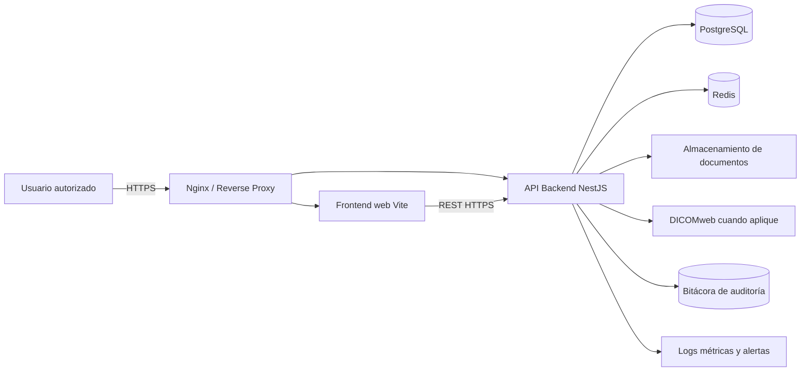
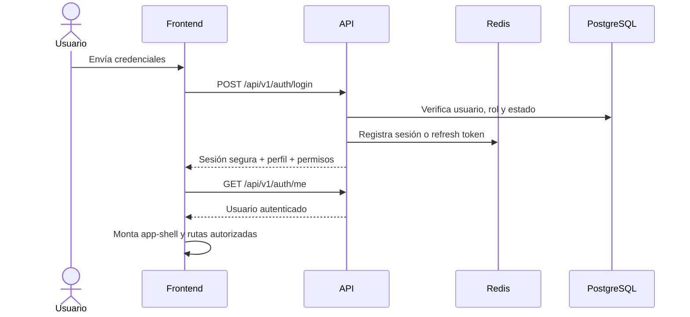
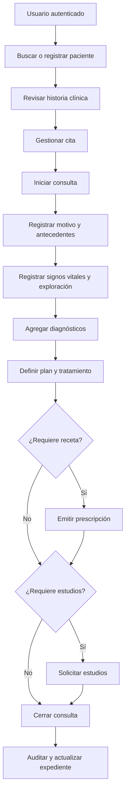

# Plataforma de Consulta Médica

## Arquitectura oficial — fase de producción activa

Este repositorio corresponde a una **plataforma web de consulta médica en fase de producción**. La etapa de demostración basada en datos JSON, `localStorage`, IndexedDB y ejecución exclusivamente local ha finalizado.

A partir de esta versión, todo cambio debe orientarse a una operación real, multiusuario, segura, auditable y desplegable en infraestructura de producción.

> **Regla principal:** antes de modificar cualquier módulo, el agente debe revisar la arquitectura y el comportamiento existente. No se permite reemplazar, eliminar o migrar componentes a ciegas.

---

## 1. Alcance del producto

La plataforma es una aplicación web destinada a:

- Médicos.
- Recepción.
- Administración.

Incluye los siguientes dominios funcionales ya presentes en el frontend:

- Dashboard.
- Gestión de pacientes.
- Ficha del paciente.
- Historia clínica.
- Consulta médica.
- Agenda y citas.
- Prescripciones y recetas.
- Documentos e imágenes médicas.
- Reportes.
- Calculadoras clínicas.
- Herramientas auxiliares.
- Configuración.

### Fuera de alcance

- APK.
- Aplicación Android o iOS.
- Cliente móvil independiente.
- Persistencia clínica en el navegador.
- Uso de archivos JSON como fuente de verdad.
- Uso de datos reales sin autenticación, autorización, auditoría, cifrado y respaldos activos.

El diseño puede ser adaptable a distintos tamaños de pantalla, pero sigue siendo un único producto web.

---

## 2. Estado real del repositorio revisado

La aplicación existente utiliza actualmente:

- Vite 5.
- HTML5.
- CSS3.
- JavaScript mediante ES Modules.
- Un `app-shell` con sidebar, topbar y área principal.
- Enrutamiento manual mediante hash.
- Carga diferida de módulos con `import()`.
- Estado global ligero en `src/js/state.js`.
- Una abstracción de datos en `src/js/services/dataService.js`.
- Datos incluidos en `src/data/*.json`.
- Persistencia heredada mediante IndexedDB y `localStorage`.

Los módulos funcionales ya consumen una interfaz común de datos:

- `initDataService()`
- `getAll()`
- `getById()`
- `query()`
- `create()`
- `update()`
- `remove()`

Esta interfaz es el principal punto de desacoplamiento y debe aprovecharse para migrar hacia la API de producción sin reconstruir innecesariamente todos los módulos.

### Componentes heredados que ya no son válidos para producción

Los siguientes elementos todavía existen en el código actual, pero deben considerarse **deuda de migración activa**:

1. `src/js/storage.js`
   - Usa `localStorage`.
   - Abre una base IndexedDB llamada `consulta_practica_demo`.
   - Persiste pacientes, citas, consultas, recetas, documentos y estudios en el navegador.

2. `src/js/services/dataService.js`
   - Importa directamente archivos JSON.
   - Fusiona datos base con cambios almacenados en IndexedDB.
   - Genera identificadores en el cliente.

3. `src/js/state.js`
   - Incluye un médico simulado en `currentUser`.
   - No obtiene la sesión desde un servicio de identidad real.

4. `src/js/main.js`
   - Inicializa datos de demostración antes de montar el router.
   - No exige autenticación antes de montar el `app-shell`.

5. `src/js/modules/configuracion.js`
   - Exporta, importa y reinicia datos de demostración.

6. Herramientas con persistencia local
   - Notas.
   - Plantillas.
   - Firmas digitales.
   - Favoritos.
   - Agenda auxiliar.
   - Preferencias de herramientas.
   - Tema visual.

7. `src/data/*.json`
   - Contiene pacientes, médicos, citas, consultas, recetas, documentos, estudios y catálogos de prueba.

Estos elementos no deben seguir utilizándose como persistencia, autenticación ni fuente de datos durante la operación de producción.

---

## 3. Arquitectura de producción obligatoria



### 3.1 Frontend web

La interfaz existente es la base funcional y visual del producto.

Debe conservarse mientras se realiza la migración controlada:

- Vite como herramienta de desarrollo y empaquetado.
- HTML, CSS y JavaScript mediante ES Modules.
- Componentes compartidos existentes.
- Variables y sistema visual de `src/styles/`.
- Módulos de `src/js/modules/`.
- Carga diferida de rutas.
- Flujos clínicos ya validados.

No se debe introducir React, Vue, Angular u otro framework sin una decisión arquitectónica explícita y documentada. Estar en producción no autoriza por sí solo a reconstruir el frontend.

### 3.2 API backend

La aplicación debe disponer de un backend real basado en:

- Node.js.
- NestJS.
- API REST versionada.
- Contrato OpenAPI.
- Validación de entradas en servidor.
- Autenticación y autorización centralizadas.
- Manejo uniforme de errores.
- Transacciones para operaciones clínicas relacionadas.

La API es la única puerta de acceso autorizada a datos clínicos.

### 3.3 Base de datos

PostgreSQL es la fuente transaccional principal.

Debe almacenar, como mínimo:

- Usuarios.
- Roles.
- Permisos.
- Sesiones o refresh tokens.
- Médicos.
- Pacientes.
- Contactos y contactos de emergencia.
- Alergias y alertas clínicas.
- Citas.
- Consultas o encuentros clínicos.
- Signos vitales.
- Diagnósticos.
- Tratamientos.
- Prescripciones.
- Medicamentos prescritos.
- Estudios solicitados.
- Documentos y metadatos de archivos.
- Catálogos.
- Bitácora de auditoría.

Toda modificación de esquema debe realizarse mediante migraciones versionadas. No se permiten cambios manuales sin registro.

### 3.4 Redis

Redis se utiliza para funciones operativas, no como fuente clínica principal:

- Sesiones y control de refresh tokens.
- Revocación de sesiones.
- Rate limiting.
- Caché de catálogos de lectura frecuente.
- Bloqueos breves de concurrencia cuando corresponda.

### 3.5 Documentos e imágenes

Los binarios no deben guardarse en `localStorage`, IndexedDB ni directamente como grandes blobs sin estrategia.

- Los documentos clínicos deben guardarse en almacenamiento de objetos seguro.
- PostgreSQL debe conservar sus metadatos, relaciones, estado y permisos.
- Las imágenes médicas deben integrarse con DICOMweb cuando el formato o flujo clínico lo requiera.
- Toda descarga debe autorizarse en backend.
- Las URL directas deben ser temporales y firmadas cuando corresponda.

### 3.6 Infraestructura

La infraestructura de producción debe incluir:

- Docker para frontend y backend.
- PostgreSQL administrado o contenido en un entorno controlado.
- Redis.
- Nginx como reverse proxy.
- HTTPS obligatorio.
- Variables de entorno gestionadas fuera del repositorio.
- Respaldos automáticos.
- Monitoreo de disponibilidad.
- Logs centralizados.
- Alertas operativas.
- Pipeline de integración y despliegue continuo.

---

## 4. Flujo de autenticación y sesión



### Reglas obligatorias

- No guardar contraseñas en el frontend.
- No guardar tokens sensibles en `localStorage` ni IndexedDB.
- Usar contraseñas con hash fuerte en backend.
- Usar access tokens de corta duración.
- Usar refresh tokens rotativos y revocables.
- Preferir cookie `HttpOnly`, `Secure` y `SameSite` para el refresh token.
- Mantener el access token en memoria o aplicar una estrategia de sesión equivalente aprobada.
- Implementar cierre de sesión en servidor.
- Implementar expiración por inactividad y duración máxima de sesión.
- Bloquear o limitar intentos repetidos de inicio de sesión.
- Registrar accesos exitosos y fallidos.
- Obtener el usuario actual desde `/auth/me`; nunca mantener un médico fijo en `state.js`.

---

## 5. Roles y permisos

Los roles base del producto son:

- `MEDICO`
- `RECEPCIONISTA`
- `ADMINISTRADOR`

Los permisos deben validarse en dos niveles:

1. **Frontend:** oculta o deshabilita opciones no autorizadas.
2. **Backend:** permite o deniega cada acción. Esta validación es obligatoria y definitiva.

### Matriz inicial

| Acción | Médico | Recepcionista | Administrador |
|---|---:|---:|---:|
| Ver dashboard | Sí | Sí | Sí |
| Buscar pacientes | Sí | Sí | Sí |
| Crear paciente | Según permiso | Sí | Sí |
| Editar datos administrativos | Según permiso | Sí | Sí |
| Ver expediente clínico | Sí | Restringido | Según permiso |
| Crear consulta | Sí | No | Según permiso |
| Registrar diagnóstico | Sí | No | Según permiso |
| Emitir receta | Sí | No | Según permiso |
| Gestionar agenda | Sí | Sí | Sí |
| Subir documentos | Sí | Según permiso | Sí |
| Ver reportes clínicos | Sí | Restringido | Sí |
| Gestionar usuarios y roles | No | No | Sí |
| Consultar auditoría | No | No | Sí |

La matriz debe convertirse en permisos concretos, por ejemplo:

- `patients.read`
- `patients.create`
- `patients.update`
- `encounters.read`
- `encounters.create`
- `prescriptions.create`
- `appointments.manage`
- `documents.upload`
- `reports.read`
- `users.manage`
- `audit.read`

No se deben dispersar comparaciones de nombres de rol por todo el código. Debe existir una capa central de autorización.

---

## 6. Rutas web que deben preservarse

Las rutas funcionales actuales son parte del contrato de navegación:

- `/dashboard`
- `/pacientes`
- `/pacientes/:id`
- `/historia-clinica/:id`
- `/consulta/:id`
- `/agenda`
- `/recetas`
- `/documentos`
- `/reportes`
- `/calculadora`
- `/herramientas`
- `/configuracion`

Debe añadirse:

- `/login`
- `/acceso-denegado`

### Reglas del router

- Una ruta protegida no puede montarse antes de resolver la sesión.
- Una sesión ausente o vencida redirige a `/login`.
- Una sesión válida sin permiso redirige a `/acceso-denegado`.
- La URL no es una autorización. El backend siempre vuelve a validar permisos.
- El router actual puede conservarse durante la migración si se agregan guardas adecuadas.
- El cambio de hash router a history router solo debe realizarse mediante una tarea separada y con configuración correcta de Nginx.

---

## 7. Contrato de acceso a datos

`dataService.js` debe dejar de importar JSON y convertirse en un cliente HTTP.

La migración debe conservar una interfaz clara para reducir cambios en los módulos:

```js
await dataService.getAll('pacientes', { page, limit, search });
await dataService.getById('pacientes', pacienteId);
await dataService.create('pacientes', payload);
await dataService.update('pacientes', pacienteId, patch);
await dataService.remove('pacientes', pacienteId);
```

### Cambio importante

Los métodos actuales de lectura son mayormente síncronos porque consultan memoria. En producción, toda operación de datos será asíncrona.

El agente debe revisar cada uso en:

- Componentes.
- Dashboard.
- Pacientes.
- Historia clínica.
- Consulta.
- Agenda.
- Recetas.
- Documentos.
- Reportes.
- Submódulos de paciente.
- Herramientas que consultan citas.

No se debe cambiar `dataService.js` a HTTP sin adaptar y probar todos sus consumidores.

### Responsabilidades del cliente HTTP

- URL base configurable por entorno.
- Encabezados de autenticación cuando corresponda.
- Timeout.
- Cancelación con `AbortController`.
- Parseo uniforme de respuestas.
- Manejo de `401`, `403`, `404`, `409`, `422`, `429` y `5xx`.
- Reintentos únicamente para operaciones seguras e idempotentes.
- Soporte de paginación, filtros y búsqueda.
- Correlation ID para diagnóstico.
- Ningún fallback silencioso hacia JSON o IndexedDB.

---

## 8. API mínima requerida

La API debe versionarse bajo `/api/v1`.

### Autenticación

- `POST /api/v1/auth/login`
- `POST /api/v1/auth/refresh`
- `POST /api/v1/auth/logout`
- `GET /api/v1/auth/me`

### Pacientes

- `GET /api/v1/patients`
- `POST /api/v1/patients`
- `GET /api/v1/patients/:id`
- `PATCH /api/v1/patients/:id`

### Citas

- `GET /api/v1/appointments`
- `POST /api/v1/appointments`
- `GET /api/v1/appointments/:id`
- `PATCH /api/v1/appointments/:id`
- `POST /api/v1/appointments/:id/status`

### Consultas

- `GET /api/v1/encounters`
- `POST /api/v1/encounters`
- `GET /api/v1/encounters/:id`
- `PATCH /api/v1/encounters/:id`
- `POST /api/v1/encounters/:id/close`

### Recetas

- `GET /api/v1/prescriptions`
- `POST /api/v1/prescriptions`
- `GET /api/v1/prescriptions/:id`
- `POST /api/v1/prescriptions/:id/cancel`

### Documentos y estudios

- `GET /api/v1/documents`
- `POST /api/v1/documents`
- `GET /api/v1/documents/:id`
- `DELETE /api/v1/documents/:id`
- `GET /api/v1/studies`
- `POST /api/v1/studies`
- `PATCH /api/v1/studies/:id`

### Catálogos

- `GET /api/v1/catalogs`
- `GET /api/v1/catalogs/diagnoses`
- `GET /api/v1/catalogs/medications`

### Administración y auditoría

- `GET /api/v1/users`
- `POST /api/v1/users`
- `PATCH /api/v1/users/:id`
- `GET /api/v1/roles`
- `GET /api/v1/audit-events`

Los nombres definitivos deben quedar reflejados en OpenAPI y ser consistentes en frontend, backend y pruebas.

---

## 9. Modelo de datos e integridad

Los JSON actuales sirven únicamente como referencia de dominio y como posibles fixtures de pruebas. No son la base de datos de producción.

### Relaciones mínimas

- Un médico puede atender muchas citas.
- Un paciente puede tener muchas citas.
- Un paciente puede tener muchas consultas.
- Una consulta pertenece a un paciente y a un médico.
- Una consulta puede producir diagnósticos, tratamientos, receta, estudios y documentos.
- Una receta pertenece a un paciente y a un médico.
- Un documento debe tener propietario clínico, categoría, estado y trazabilidad.
- Toda operación sensible debe producir un evento de auditoría.

### Reglas

- Los identificadores se generan en servidor.
- Las fechas se almacenan con zona horaria definida.
- Las escrituras relacionadas usan transacciones.
- Los borrados clínicos deben evaluarse como baja lógica, no eliminación física automática.
- Debe existir control de concurrencia para evitar sobrescrituras silenciosas.
- La base de datos debe aplicar claves foráneas, restricciones y unicidad.
- Las reglas clínicas y de seguridad se validan en backend.
- Los catálogos no deben duplicarse dentro de cada registro.

---

## 10. Eliminación de almacenamiento local

La aplicación de producción no utiliza el navegador como base de datos.

### Debe eliminarse del flujo activo

- IndexedDB para pacientes, citas, consultas, recetas, documentos o estudios.
- `localStorage` para notas clínicas.
- `localStorage` para plantillas clínicas.
- `localStorage` para firmas digitales.
- `localStorage` para agenda auxiliar.
- `localStorage` para favoritos o configuraciones que deban sincronizarse.
- Importación o exportación manual de expedientes mediante JSON.
- Reinicio de datos de demostración.

### Destino de cada tipo de información

| Información | Destino de producción |
|---|---|
| Pacientes y expedientes | PostgreSQL mediante API |
| Citas y agenda | PostgreSQL mediante API |
| Consultas y diagnósticos | PostgreSQL mediante API |
| Recetas | PostgreSQL mediante API |
| Documentos | Almacenamiento seguro + metadatos en PostgreSQL |
| Firmas | Servicio seguro de archivos y trazabilidad |
| Notas y plantillas | Perfil del usuario o módulo correspondiente en backend |
| Favoritos | Preferencias del usuario en backend |
| Tema visual | Preferencia de usuario en backend o valor temporal en memoria |
| Sesión | Backend + Redis/cookie segura |

`src/js/storage.js` debe retirarse cuando todos sus consumidores hayan sido migrados. No debe eliminarse antes de identificar y sustituir cada importación.

---

## 11. Estructura recomendada durante la migración

La migración debe minimizar rupturas en el frontend existente.

```text
Plataforma de consulta medica/
├── index.html
├── package.json
├── vite.config.js
├── src/
│   ├── assets/
│   ├── js/
│   │   ├── components/
│   │   ├── modules/
│   │   ├── services/
│   │   │   ├── apiClient.js
│   │   │   ├── authService.js
│   │   │   └── dataService.js
│   │   ├── main.js
│   │   ├── router.js
│   │   └── state.js
│   └── styles/
├── backend/
│   ├── src/
│   │   ├── auth/
│   │   ├── users/
│   │   ├── roles/
│   │   ├── patients/
│   │   ├── appointments/
│   │   ├── encounters/
│   │   ├── prescriptions/
│   │   ├── documents/
│   │   ├── studies/
│   │   ├── catalogs/
│   │   ├── audit/
│   │   └── common/
│   ├── migrations/
│   └── test/
├── infra/
│   ├── nginx/
│   ├── docker/
│   └── monitoring/
├── docker-compose.yml
├── .env.example
└── README.md
```

No se debe mover el frontend a otra carpeta durante la primera migración salvo que exista una tarea específica que actualice importaciones, Vite, Docker, CI/CD y despliegue de manera coordinada.

---

## 12. Flujo clínico que debe conservarse



La migración técnica no debe perder:

- Datos del paciente.
- Motivo de consulta.
- Padecimiento actual.
- Antecedentes.
- Síntomas.
- Signos vitales.
- Exploración física.
- Diagnósticos.
- Plan terapéutico.
- Medicamentos.
- Estudios.
- Documentos.
- Estado y cierre de consulta.
- Relación con médico y cita.
- Trazabilidad de cada cambio.

---

## 13. Guía obligatoria para el agente de programación

Antes de realizar cualquier cambio, el agente debe seguir este orden.

### Paso 1 — Revisar el repositorio real

Leer como mínimo:

- `package.json`
- `package-lock.json`
- `vite.config.js`
- `index.html`
- `src/js/main.js`
- `src/js/router.js`
- `src/js/state.js`
- `src/js/storage.js`
- `src/js/services/dataService.js`
- `src/js/components/`
- El módulo funcional que será modificado.
- Sus submódulos.
- Los JSON relacionados para entender el contrato heredado.
- `src/styles/variables.css`
- `src/styles/main.css`
- `src/styles/responsive.css`

También debe ejecutar:

```bash
git status
git diff
npm install
npm run build
```

No se debe asumir que este README reemplaza la inspección del código.

### Paso 2 — Documentar el impacto

Antes de programar, identificar:

- Archivos que consumen el componente a cambiar.
- Rutas afectadas.
- Contratos de datos afectados.
- Permisos necesarios.
- Endpoints necesarios.
- Tablas o migraciones necesarias.
- Riesgos de seguridad.
- Pruebas que deben añadirse.

### Paso 3 — Mantener compatibilidad funcional

- No eliminar rutas existentes sin una migración aprobada.
- No recrear módulos que pueden adaptarse.
- No duplicar servicios.
- Reutilizar componentes y estilos compartidos.
- Mantener nombres y relaciones del dominio cuando sigan siendo válidos.
- Cambiar un flujo funcional por vez.

### Paso 4 — Implementar primero el backend necesario

Para una función que escribe o lee datos reales:

1. Definir contrato y permiso.
2. Crear migración de base de datos.
3. Crear endpoint y validación.
4. Añadir autorización.
5. Añadir auditoría.
6. Añadir pruebas de backend.
7. Conectar el frontend.
8. Añadir estados de carga y error.
9. Probar el flujo completo.

### Paso 5 — No introducir persistencia temporal insegura

Si un endpoint todavía no existe:

- No guardar el dato en `localStorage`.
- No guardar el dato en IndexedDB.
- No añadir otro JSON.
- No simular éxito si la operación falló.
- Mostrar una función no disponible o trabajar con fixtures solo dentro de pruebas automatizadas.

### Paso 6 — Validar antes de entregar

Toda tarea debe comprobar:

- Autenticación.
- Permisos.
- Validación de datos.
- Manejo de errores.
- Auditoría.
- Integridad de relaciones.
- Accesibilidad básica.
- Build del frontend.
- Build y pruebas del backend.
- Migraciones.
- Contenedores.
- Despliegue en entorno de prueba.

---

## 14. Orden de implementación de la fase de producción

La siguiente secuencia es la ruta de trabajo vigente.

### Etapa 0 — Inventario y estabilización

- Crear rama de producción o migración.
- Ejecutar el frontend actual.
- Registrar rutas y flujos que funcionan.
- Identificar todos los usos de `dataService.js` y `storage.js`.
- Clasificar datos clínicos, administrativos y preferencias.
- Añadir pruebas de humo de las rutas principales.

### Etapa 1 — Infraestructura base

- Crear backend NestJS.
- Configurar PostgreSQL.
- Configurar Redis.
- Configurar variables de entorno.
- Añadir Docker y Nginx.
- Crear health checks.
- Configurar logs estructurados.

### Etapa 2 — Esquema y migraciones

- Diseñar entidades a partir de los contratos JSON existentes.
- Crear migraciones.
- Crear seeds solo para desarrollo y pruebas.
- Añadir restricciones, índices y relaciones.
- Definir estrategia de baja lógica y concurrencia.

### Etapa 3 — Autenticación, roles y auditoría

- Implementar usuarios reales.
- Implementar login, refresh y logout.
- Implementar roles y permisos.
- Crear `/auth/me`.
- Crear auditoría de acceso y escritura.
- Integrar login con el `app-shell`.
- Eliminar el usuario simulado.

### Etapa 4 — Migración de pacientes y agenda

- Pacientes.
- Médicos.
- Citas.
- Búsqueda y paginación.
- Agenda diaria.
- Estados de cita.

### Etapa 5 — Migración clínica

- Historia clínica.
- Consultas.
- Signos vitales.
- Diagnósticos.
- Tratamientos.
- Recetas.
- Estudios.

### Etapa 6 — Documentos e imágenes

- Carga segura.
- Antivirus o análisis de archivos.
- Validación de tipo y tamaño.
- Almacenamiento de objetos.
- Autorización de descarga.
- Auditoría.
- Integración DICOMweb cuando corresponda.

### Etapa 7 — Retiro de persistencia local

- Migrar notas, plantillas, firmas, favoritos y configuraciones.
- Retirar exportación/importación JSON.
- Retirar reinicio de datos demo.
- Retirar imports de `src/data/*.json` del runtime.
- Retirar IndexedDB.
- Retirar `localStorage`.
- Eliminar `storage.js` únicamente cuando no tenga consumidores.

### Etapa 8 — Operación y despliegue

- HTTPS.
- Cabeceras de seguridad.
- CORS limitado.
- Protección CSRF según estrategia de cookies.
- Rate limiting.
- Backups y prueba de restauración.
- Métricas y alertas.
- Pipeline CI/CD.
- Despliegue controlado.
- Plan de reversión.

---

## 15. Seguridad obligatoria

La plataforma maneja información clínica sensible.

### Backend

- Validar todos los DTO.
- Aplicar autorización por endpoint y recurso.
- Evitar exposición de campos innecesarios.
- Usar consultas parametrizadas mediante la capa de datos.
- Registrar eventos sensibles.
- Aplicar rate limiting.
- Gestionar secretos fuera de Git.
- Cifrar comunicaciones.
- Cifrar respaldos y almacenamiento cuando corresponda.
- Evitar datos sensibles en logs.

### Frontend

- No confiar en controles visuales como mecanismo de seguridad.
- No insertar HTML no confiable.
- No almacenar información clínica en el navegador.
- No registrar expedientes en la consola.
- Manejar expiración de sesión.
- Limpiar estado en logout.
- Mostrar errores seguros sin revelar detalles internos.

### Auditoría

Como mínimo debe registrarse:

- Usuario.
- Rol.
- Acción.
- Recurso.
- Identificador del recurso.
- Fecha y hora.
- Resultado.
- IP o contexto técnico permitido por normativa.
- Correlation ID.

La bitácora no debe poder modificarse desde los módulos clínicos normales.

---

## 16. Variables de entorno

Debe existir un `.env.example` sin secretos.

Ejemplo de categorías:

```env
NODE_ENV=
APP_URL=
API_BASE_URL=
DATABASE_URL=
REDIS_URL=
JWT_ACCESS_SECRET=
JWT_REFRESH_SECRET=
JWT_ACCESS_TTL=
JWT_REFRESH_TTL=
CORS_ALLOWED_ORIGINS=
STORAGE_ENDPOINT=
STORAGE_BUCKET=
STORAGE_ACCESS_KEY=
STORAGE_SECRET_KEY=
LOG_LEVEL=
```

Nunca se deben incluir valores reales en el repositorio.

---

## 17. Pruebas requeridas

### Frontend

- Renderizado de rutas.
- Guardas de autenticación.
- Guardas de permiso.
- Estados de carga.
- Estados vacíos.
- Manejo de errores de API.
- Formularios y validación de UX.
- Flujos críticos de pacientes, citas y consulta.

### Backend

- Autenticación.
- Renovación y revocación de sesión.
- Autorización por rol y permiso.
- Validación de DTO.
- Integridad de pacientes y relaciones.
- Transacciones clínicas.
- Auditoría.
- Carga y descarga de documentos.
- Concurrencia.

### Integración y extremo a extremo

- Login.
- Crear y localizar paciente.
- Agendar cita.
- Iniciar consulta.
- Guardar signos vitales.
- Registrar diagnóstico.
- Emitir receta.
- Solicitar estudio.
- Subir documento.
- Cerrar consulta.
- Verificar auditoría.
- Cerrar sesión.

---

## 18. Criterios de aceptación

Una funcionalidad se considera terminada cuando:

- Usa la API de producción.
- No depende de JSON del frontend.
- No persiste información en `localStorage` o IndexedDB.
- Tiene autenticación y permisos.
- Valida datos en backend.
- Registra auditoría cuando corresponde.
- Maneja carga, error y ausencia de datos.
- Tiene pruebas.
- No rompe rutas ni módulos existentes.
- Compila correctamente.
- Pasa migraciones.
- Funciona en el entorno de despliegue.
- No expone secretos ni datos clínicos en logs.
- Está documentada.

---

## 19. Prohibiciones para cualquier agente

No se permite:

- Tratar la aplicación como una demo localhost.
- Mantener JSON como fuente de verdad.
- Añadir persistencia clínica al navegador.
- Guardar tokens sensibles en `localStorage`.
- Conectar el frontend directamente a PostgreSQL.
- Omitir autorización en backend.
- Usar datos reales antes de completar controles de seguridad.
- Eliminar módulos existentes para recrearlos sin análisis.
- Cambiar de framework sin autorización documentada.
- Introducir rutas absolutas o dependencias del sistema operativo.
- Incluir `.env` real, credenciales, certificados privados o backups en Git.
- Empaquetar `node_modules` en entregables.
- Marcar una operación como exitosa si la API falló.
- Desactivar auditoría para simplificar una tarea.

---

## 20. Checklist de revisión antes de cada cambio

- [ ] Revisé `git status` y `git diff`.
- [ ] Leí los archivos centrales de arquitectura.
- [ ] Leí el módulo y sus dependencias.
- [ ] Identifiqué el contrato de datos actual.
- [ ] Identifiqué endpoint, permiso y tablas afectadas.
- [ ] Confirmé que no usaré almacenamiento local.
- [ ] Confirmé que no usaré JSON en runtime.
- [ ] Añadí validación de backend.
- [ ] Añadí autorización.
- [ ] Añadí auditoría cuando corresponde.
- [ ] Añadí manejo de errores en frontend.
- [ ] Añadí o actualicé pruebas.
- [ ] Ejecuté build del frontend.
- [ ] Ejecuté pruebas y build del backend.
- [ ] Probé migraciones.
- [ ] Verifiqué que no se expongan secretos.
- [ ] Documenté el cambio.

---

## 21. Comandos actuales del frontend

```bash
npm install
npm run dev
npm run build
npm run preview
```

Estos comandos corresponden al frontend existente. Los comandos del backend de producción deben documentarse en el mismo repositorio y ejecutarse desde CI/CD.

El nombre y la descripción actuales de `package.json` todavía hacen referencia a localhost y a una fase sin backend. Deben actualizarse dentro de la tarea de implementación correspondiente, junto con los scripts de producción; no deben cambiarse de forma aislada sin revisar el despliegue.

---

## 22. Definición final de la arquitectura

La Plataforma de Consulta Médica es una aplicación web con:

- Frontend Vite basado en la interfaz ya construida.
- Backend NestJS como capa de aplicación y seguridad.
- PostgreSQL como fuente de verdad.
- Redis para sesiones, caché y protección operativa.
- Almacenamiento seguro para documentos.
- DICOMweb para imágenes médicas cuando aplique.
- Nginx y HTTPS como entrada de producción.
- Docker y CI/CD para despliegue reproducible.
- Roles, permisos y sesiones reales.
- Auditoría de accesos y modificaciones.
- Respaldos, monitoreo y restauración probada.
- Cero persistencia clínica o funcional en localhost, `localStorage` o IndexedDB.

Todo agente debe respetar esta arquitectura y, al mismo tiempo, estudiar el código existente antes de introducir cambios para preservar los flujos, componentes y contratos que continúan siendo válidos.
