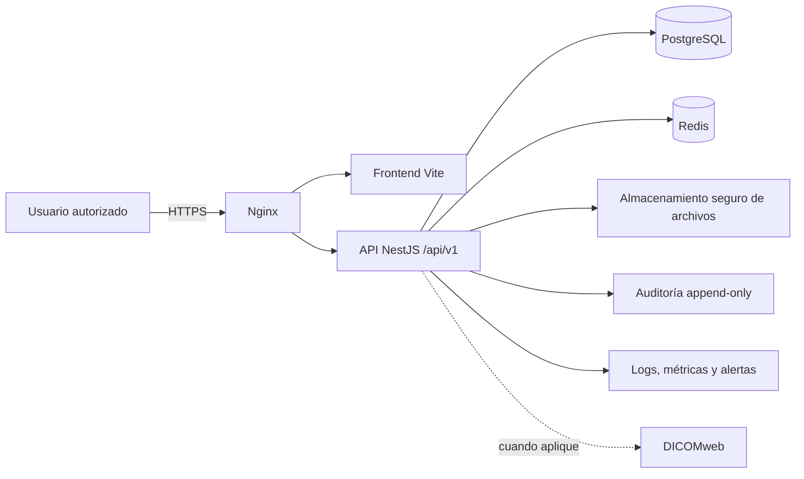

# Plataforma de Consulta Médica

## Estado del proyecto

La plataforma está en desarrollo y **no está autorizada para procesar datos clínicos reales**. El repositorio ya contiene un frontend Vite y una primera implementación de API NestJS, pero aún no cumple los requisitos de seguridad, auditoría, migraciones y operación necesarios para producción.

Este README es la guía rectora de arquitectura, compatibilidad y fases de trabajo. Si un plan, diagrama o documento externo discrepa, prevalece este documento, seguido por OpenAPI, las migraciones versionadas y las pruebas.

## Arquitectura actual

| Área | Estado actual |
|---|---|
| Frontend | Vite 5, HTML, CSS y JavaScript ES Modules, con router hash y módulos existentes en `src/js/`. |
| Cliente de datos | `src/js/services/dataService.js` consume la API bajo `/api/v1`; aún usa token en `localStorage`/`sessionStorage`, lo cual debe eliminarse. |
| API | NestJS + TypeScript en `server/`. TypeORM es el ORM seleccionado. |
| Persistencia | PostgreSQL mediante TypeORM. Hoy `synchronize: true` crea esquema automáticamente: solo es aceptable de forma temporal en desarrollo. |
| Caché/sesiones | Redis está disponible mediante Docker, pero aún no se usa para sesiones ni revocación. |
| Contenedores | `docker-compose.yml` inicia PostgreSQL y Redis para desarrollo local; todavía no contiene servicios de API, frontend ni Nginx. |
| Documentos | El backend usa almacenamiento local temporal en `uploads/`; no es almacenamiento clínico de producción. |

## Decisiones de compatibilidad

- El producto es una única aplicación web. No se crearán APK ni clientes móviles independientes.
- Se conserva Vite, HTML, CSS y JavaScript ES Modules. No se incorpora React, Vue, Angular ni otro framework sin una decisión arquitectónica documentada.
- Se conserva el hash router durante la migración inicial. Un cambio a history router requiere una tarea separada, configuración de Nginx y pruebas de rutas directas.
- NestJS es la única puerta de acceso a datos clínicos. PostgreSQL es la fuente transaccional de verdad; Redis es auxiliar.
- TypeORM es el único ORM del proyecto. No se añadirá Prisma.
- Los JSON de `src/data/` son referencia de dominio, fixtures o seeds; no son fuente de verdad ni persistencia de producción.
- IndexedDB y `localStorage` no pueden almacenar datos clínicos, contraseñas ni tokens sensibles. Se retiran solo después de migrar todos sus consumidores.
- Los identificadores los genera el servidor; las fechas se almacenan como `timestamptz`; las operaciones clínicas relacionadas usan transacciones.
- Los registros clínicos y documentos se eliminan mediante baja lógica, incluso cuando el contrato exponga `DELETE`.

## API implementada hoy

El prefijo global es `/api/v1`. Los recursos existentes conservan los nombres del dominio del frontend:

- `POST /auth/login`
- CRUD parcial de `/pacientes`, `/citas`, `/consultas`, `/recetas`, `/estudios` y `/documentos`
- Lectura de `/catalogos`

La existencia de un endpoint no significa que esté listo para producción. En particular, faltan o están incompletos `/auth/refresh`, `/auth/logout`, `/auth/me`, usuarios, roles, permisos granulares, auditoría, paginación, control de concurrencia, migraciones y contrato OpenAPI.

## Bloqueantes actuales de producción

Antes de conectar datos reales se debe resolver lo siguiente:

- Reemplazar las credenciales de demostración de autenticación por usuarios reales, contraseñas con hash fuerte y roles/permisos.
- Eliminar los valores por defecto de base de datos y JWT; las credenciales se obtienen exclusivamente desde variables de entorno.
- Sustituir `synchronize: true` por migraciones TypeORM versionadas y reproducibles.
- Implementar refresh tokens rotativos, revocación en Redis, expiración por inactividad y cierre de sesión en servidor.
- Retirar el token de `localStorage` y `sessionStorage`; el access token debe residir en memoria y el refresh token en cookie `HttpOnly`, `Secure` y `SameSite`.
- Añadir autorización por permiso y auditoría append-only de accesos a expedientes y escrituras sensibles.
- Reemplazar el directorio local `uploads/` por almacenamiento seguro de objetos, validación de tipo/tamaño y URLs de descarga autorizadas.
- Añadir Dockerfiles, Nginx, HTTPS, CORS restringido, CSRF cuando se usen cookies, respaldos, monitoreo y CI/CD.

## Arquitectura objetivo



## Reglas de seguridad y datos

- El backend valida todos los DTO, permisos y reglas de negocio; los controles visuales del frontend no son seguridad.
- El frontend no hace fallback silencioso a JSON, IndexedDB o `localStorage` si una operación de API falla.
- No se registran expedientes, contraseñas, tokens o datos clínicos en consola ni logs.
- Cada escritura clínica y cada lectura de expediente generan un evento de auditoría con usuario, rol, acción, recurso, resultado, fecha y correlation ID. Health checks y archivos estáticos se excluyen.
- Los binarios no se almacenan en la base de datos ni en el navegador; PostgreSQL conserva metadatos, relaciones, estado y permisos.

## Fases de implementación

Las fases se entregan en cortes verticales: contrato OpenAPI → migración → endpoint validado/autorizado/auditado → pruebas backend → módulo frontend → pruebas extremo a extremo. Una fase no se considera terminada solo porque su código exista.

### Fase 0 — Estabilización e inventario

- Verificar build de frontend y backend, estado de Git y módulos consumidores de `dataService.js`, `storage.js` y utilidades con almacenamiento local.
- Sacar del índice los artefactos generados ya versionados (`node_modules/` y `dist/`) y confirmar `.gitignore`.
- Crear `server/.env.example`, eliminar secretos/valores por defecto de código y Docker Compose, y añadir `server/package-lock.json`.

**Salida:** instalación reproducible, secretos fuera del repositorio e inventario de dependencias heredadas.

### Fase 1 — Base de datos e infraestructura de desarrollo

- Reemplazar `synchronize: true` por migraciones TypeORM, restricciones, índices, baja lógica y `timestamptz`.
- Configurar variables de entorno, health check, logs seguros y contenedores para API y frontend.
- Mantener PostgreSQL y Redis solo como dependencias de desarrollo hasta completar controles de seguridad.

**Salida:** una base vacía migra desde cero y el entorno local no depende de credenciales incorporadas al código.

### Fase 2 — Identidad, permisos y auditoría

- Implementar usuarios, médicos, roles y permisos granulares.
- Completar login, refresh, logout y `/auth/me`; integrar Redis para sesiones revocables y límites de intentos.
- Conectar login, guardas de rutas, topbar y sidebar; retirar almacenamiento local del token.
- Crear bitácora append-only y pruebas de autenticación, autorización y auditoría.

**Salida:** ninguna ruta protegida se monta sin sesión; `401` redirige a login y `403` a acceso denegado.

### Fase 3 — Pacientes y agenda

- Completar pacientes, médicos y citas con paginación, filtros, búsqueda, permisos y control de concurrencia.
- Validar en backend las transiciones de cita y migrar los módulos frontend correspondientes.

**Salida:** crear/buscar paciente y agendar/modificar una cita funciona extremo a extremo, con auditoría.

### Fase 4 — Núcleo clínico

- Completar consultas, signos vitales, diagnósticos, tratamientos, recetas, estudios y catálogos.
- Cerrar una consulta mediante transacción y limitar su modificación al médico autorizado.

**Salida:** el flujo clínico persiste de forma consistente, auditable y sin sobrescrituras silenciosas.

### Fase 5 — Documentos e imágenes

- Migrar documentos a almacenamiento seguro con validación, antivirus cuando corresponda, URLs temporales firmadas y auditoría de descarga.
- Integrar DICOMweb únicamente cuando exista un flujo clínico y servidor aprobados.

**Salida:** ningún documento clínico se guarda en el navegador ni en un directorio local de producción.

### Fase 6 — Retiro de persistencia local

- Migrar notas, plantillas, firmas, favoritos y preferencias que deban sincronizarse.
- Retirar los imports runtime de JSON, IndexedDB, `storage.js`, exportación/importación de demo y reinicios de datos.

**Salida:** ningún módulo funcional o clínico depende de persistencia local.

### Fase 7 — Operación y despliegue

- Completar OpenAPI, pruebas unitarias, integración y extremo a extremo.
- Añadir Nginx, HTTPS, CORS, CSRF, cabeceras, backups cifrados con restauración probada, métricas, alertas y CI/CD.
- Desplegar primero en staging con plan de reversión.

**Salida:** todos los controles de seguridad, pruebas, migraciones y operación están verificados antes de producción.

## Comandos de desarrollo

### Frontend

```bash
npm install
npm run dev
npm run build
```

### Backend

```bash
cd server
npm install
npm run start:dev
npm run build
```

### Servicios locales

```bash
docker compose up -d postgres redis
```

El Docker Compose actual es exclusivo de desarrollo y no debe usarse con sus valores por defecto en producción.

## Definición de terminado

Un cambio se entrega solo si identifica los módulos y contratos afectados, añade migración/validación/permisos/auditoría cuando aplique, maneja carga/error/conflicto en frontend, incluye pruebas proporcionales al riesgo y no introduce persistencia local, secretos ni datos clínicos en logs.
