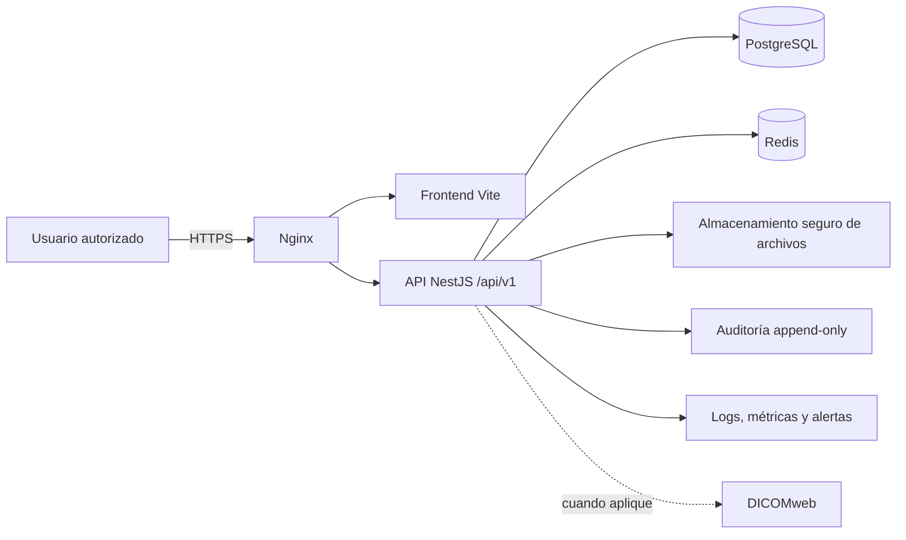

# Plataforma de Consulta Médica

## Estado del proyecto

La plataforma está en desarrollo y **no está autorizada para procesar datos clínicos reales**. El repositorio ya contiene un frontend Vite y una primera implementación de API NestJS, pero aún no cumple los requisitos de seguridad, auditoría, migraciones y operación necesarios para producción.

Este README es la guía rectora de arquitectura, compatibilidad y fases de trabajo. Si un plan, diagrama o documento externo discrepa, prevalece este documento, seguido por OpenAPI, las migraciones versionadas y las pruebas.

## Arquitectura actual

| Área | Estado actual |
|---|---|
| Frontend | Vite 5, HTML, CSS y JavaScript ES Modules, con router hash y módulos existentes en `src/js/`. |
| Cliente de datos | `src/js/services/dataService.js` consume la API bajo `/api/v1`; el access token vive solo en memoria y el refresh token en una cookie `HttpOnly`. |
| API | NestJS + TypeScript en `server/`. TypeORM es el ORM seleccionado. |
| Persistencia | PostgreSQL mediante TypeORM. El esquema se crea con migraciones versionadas y `synchronize: false`. |
| Caché/sesiones | PostgreSQL es la fuente de verdad de sesiones revocables y refresh tokens rotativos. Redis, cuando se habilita, distribuye los límites de login y la caché de revocación. |
| Contenedores | `docker-compose.yml` inicia PostgreSQL y Redis para desarrollo local; todavía no contiene servicios de API, frontend ni Nginx. |
| Documentos | El backend usa almacenamiento local temporal en `uploads/`; no es almacenamiento clínico de producción. |

## Decisiones de compatibilidad

- El producto es una única aplicación web. No se crearán APK ni clientes móviles independientes.
- Se conserva Vite, HTML, CSS y JavaScript ES Modules. No se incorpora React, Vue, Angular ni otro framework sin una decisión arquitectónica documentada.
- Se conserva el hash router durante la migración inicial. Un cambio a history router requiere una tarea separada, configuración de Nginx y pruebas de rutas directas.
- NestJS es la única puerta de acceso a datos clínicos. PostgreSQL es la fuente transaccional de verdad; Redis es auxiliar.
- TypeORM es el único ORM del proyecto. No se añadirá Prisma.
- Los JSON de `src/data/` son referencia de dominio, fixtures o seeds; no son fuente de verdad ni persistencia de producción.
- IndexedDB y `localStorage` no pueden almacenar datos clínicos, contraseñas ni tokens sensibles. Se retiran solo después de migrar todos sus consumidores.
- Los identificadores los genera el servidor; las fechas se almacenan como `timestamptz`; las operaciones clínicas relacionadas usan transacciones.
- Los registros clínicos y documentos se eliminan mediante baja lógica, incluso cuando el contrato exponga `DELETE`.

## API implementada hoy

El prefijo global es `/api/v1`. Los recursos existentes conservan los nombres del dominio del frontend:

- `POST /auth/login`, `POST /auth/refresh`, `POST /auth/logout` y `GET /auth/me`
- Administración protegida: `GET`/`POST`/`PATCH /usuarios`, `GET /usuarios/roles` y `GET /auditoria`
- Lectura de `/medicos`
- CRUD de `/pacientes`, `/citas`, `/consultas`, `/recetas` y `/estudios` con validación de referencias y autoría médica
- CRUD parcial de `/documentos`
- Lectura de `/catalogos`

La existencia de un endpoint no significa que esté listo para producción. La primera entrega de identidad ya incluye usuarios, roles, permisos, sesiones revocables, límites de login, expiración por inactividad, detección de reutilización de refresh token, administración básica y auditoría append-only. `pacientes`, `citas`, `consultas`, `recetas`, `estudios` y `medicos` ya cuentan con contrato OpenAPI (`GET /api/docs`) y pruebas de integración (`npm run test:e2e`); `documentos` todavía no tiene su propio corte funcional ni controles operativos de producción.

### Listados de Fase 3

- `GET /pacientes?page=1&limit=50&q=ana&estado=activo` devuelve `{ items, pagination }`. `q` busca nombre, apellidos, identificador, CURP y NSS. `limit` admite de 1 a 100.
- `GET /citas?page=1&limit=50&fecha=YYYY-MM-DD&medicoId=<uuid>&pacienteId=<uuid>&consultorioId=<texto>&estado=<estado>` devuelve `{ items, pagination }`. También acepta `fechaDesde` y `fechaHasta` cuando no se consulta una fecha puntual.
- El cliente conserva `getAll()` para recursos que aún devuelven arreglos y ofrece `getPage()` para los listados paginados. Esto evita romper módulos heredados durante la migración.
- Al crear o modificar una cita, el backend valida médico y paciente activos, el intervalo horario, los cambios de estado y los solapes de médico o consultorio. Un solape devuelve `409 Conflict`; una transición inválida devuelve `400 Bad Request`.

### Núcleo clínico de Fase 4

- `GET /consultas?pacienteId=<uuid>`, `GET /recetas?pacienteId=<uuid>` y `GET /estudios?pacienteId=<uuid>` exigen `pacienteId`; omitirlo devuelve `400` en vez de todos los registros.
- Crear o modificar una consulta, receta o estudio exige que `medicoId` coincida con el médico de la sesión autenticada; si no coincide, devuelve `403`.
- `PATCH /consultas/:id` con `{ "estado": "completada" }` cierra la consulta en una transacción con bloqueo; cualquier `PATCH` posterior sobre una consulta `completada` devuelve `400`.
- `POST /recetas` ignora cualquier `folio` que envíe el cliente; el servidor lo asigna a partir de la secuencia `recetas_folio_seq`.

## Bloqueantes actuales de producción

Antes de conectar datos reales se debe resolver lo siguiente:

- Sustituir la cuenta sintética de desarrollo por usuarios administrados y revisados antes de cualquier entorno no local.
- Eliminar los valores por defecto de base de datos y JWT; las credenciales se obtienen exclusivamente desde variables de entorno.
- Mantener y revisar las migraciones TypeORM versionadas antes de cada cambio de esquema.
- Habilitar Redis obligatorio fuera de desarrollo y definir una política revisada de duración de sesión por inactividad.
- Configurar `REFRESH_COOKIE_SECURE=true`, HTTPS y CSRF antes de desplegar cookies fuera de localhost.
- Revisar periódicamente la integridad y retención de la auditoría append-only.
- Reemplazar el directorio local `uploads/` por almacenamiento seguro de objetos, validación de tipo/tamaño y URLs de descarga autorizadas.
- Añadir Dockerfiles, Nginx, HTTPS, CORS restringido, CSRF cuando se usen cookies, respaldos, monitoreo y CI/CD.

## Arquitectura objetivo



## Reglas de seguridad y datos

- El backend valida todos los DTO, permisos y reglas de negocio; los controles visuales del frontend no son seguridad.
- El frontend no hace fallback silencioso a JSON, IndexedDB o `localStorage` si una operación de API falla.
- No se registran expedientes, contraseñas, tokens o datos clínicos en consola ni logs.
- Cada escritura clínica y cada lectura de expediente generan un evento de auditoría con usuario, rol, acción, recurso, resultado, fecha y correlation ID. Health checks y archivos estáticos se excluyen.
- Los binarios no se almacenan en la base de datos ni en el navegador; PostgreSQL conserva metadatos, relaciones, estado y permisos.

## Fases de implementación

Las fases se entregan en cortes verticales: contrato OpenAPI → migración → endpoint validado/autorizado/auditado → pruebas backend → módulo frontend → pruebas extremo a extremo. Una fase no se considera terminada solo porque su código exista.

### Fase 0 — Estabilización e inventario

- Verificar build de frontend y backend, estado de Git y módulos consumidores de `dataService.js`, `storage.js` y utilidades con almacenamiento local.
- Sacar del índice los artefactos generados ya versionados (`node_modules/` y `dist/`) y confirmar `.gitignore`.
- Crear `server/.env.example`, eliminar secretos/valores por defecto de código y Docker Compose, y añadir `server/package-lock.json`.

**Salida:** instalación reproducible, secretos fuera del repositorio e inventario de dependencias heredadas.

### Fase 1 — Base de datos e infraestructura de desarrollo

- Mantener migraciones TypeORM, restricciones e `timestamptz`; la primera migración del esquema ya está aplicada localmente.
- Configurar variables de entorno, health check y logs seguros; quedan pendientes los contenedores para API y frontend.
- Mantener PostgreSQL y Redis solo como dependencias de desarrollo hasta completar controles de seguridad.

**Salida:** una base vacía migra desde cero, cuenta con health check en `GET /api/v1/health`, datos sintéticos opcionales para desarrollo y no depende de credenciales incorporadas al código.

### Fase 2 — Identidad, permisos y auditoría

- Se implementaron usuarios asociados opcionalmente a médicos, roles `ADMIN`/`MEDICO`/`ASISTENTE`, permisos granulares y guardas sobre los recursos clínicos.
- Se implementaron login, refresh rotativo, logout, `/auth/me`, sesiones revocables en PostgreSQL y cookie `HttpOnly` para refresh. El access token reside únicamente en memoria.
- Se agregó pantalla de login, restauración de sesión, guardas de rutas y cierre de sesión en la barra lateral.
- La bitácora registra autenticación y lecturas/escrituras protegidas; PostgreSQL impide `UPDATE` y `DELETE` sobre `auditoria` mediante trigger.
- Redis limita los intentos fallidos por identidad seudonimizada mediante HMAC y replica la revocación de sesión. Si está apagado en desarrollo, existe una reserva local; en un entorno compartido debe configurarse `REDIS_ENABLED=true` y `REDIS_REQUIRED=true`.
- El rol con `usuarios:gestionar` puede abrir `#/administracion`, crear usuarios, asignar los roles existentes, activar/desactivar cuentas y reiniciar contraseñas. El backend conserva al menos un administrador activo y revoca sesiones al desactivar o restablecer una contraseña.
- Los rechazos de permisos quedan auditados como `authorization.denied`, sin registrar cuerpos ni datos clínicos. Cada refresh se consume una sola vez: su reutilización revoca la sesión, registra `auth.refresh_reuse` y propaga la revocación a Redis.
- La sesión conserva un vencimiento absoluto y uno configurable por inactividad (`SESSION_IDLE_TTL_MINUTES`, 60 minutos en desarrollo). Al vencer, se revoca en PostgreSQL y Redis y registra `auth.session_idle_timeout`.
- Pendiente en esta fase: políticas operativas de retención y revisión de auditoría.

**Salida actual:** ninguna ruta protegida se monta sin sesión; `401` redirige a login, `403` se presenta como acceso denegado y las acciones protegidas quedan auditadas.

### Fase 3 — Pacientes y agenda

- Implementado: `/pacientes` y `/citas` admiten paginación, filtros y búsqueda autorizada desde el backend; la interfaz de Pacientes y Agenda los consume directamente.
- Implementado: las consultas de agenda traen médico y paciente asociados, por lo que se eliminaron lecturas adicionales por cada cita. La fecha inicial de Agenda ya usa el día local y el filtro por paciente se aplica antes de cargar la vista.
- Implementado: la creación y edición de citas se ejecutan en una transacción, toman bloqueos transaccionales de PostgreSQL por médico/fecha y consultorio/fecha, rechazan solapes con `409` y validan las transiciones `pendiente → confirmada → en_consulta → completada` o cancelación desde los estados no finales.
- Implementado: contrato OpenAPI de `/pacientes` y `/citas` servido en `GET /api/docs` (deshabilitado cuando `NODE_ENV=production`).
- Implementado: pruebas automatizadas de integración (`npm run test:e2e` en `server/`) contra una base PostgreSQL de pruebas real y aislada, cubriendo paginación, búsqueda, filtros, solapes (`409`), transiciones de estado (`400`) y autorización (`401`/`403`) de `pacientes` y `citas`.
- Pendiente: extender el contrato OpenAPI y las pruebas automatizadas a `consultas`, `recetas`, `estudios` y `documentos` cuando esos módulos reciban su propio corte funcional (Fase 4).

**Salida verificada:** buscar paciente, filtrar la agenda y rechazar un solape o transición inválida funciona contra la base local autenticada, y queda cubierto por pruebas automatizadas repetibles. Falta la navegación visual de extremo a extremo (Playwright u otra herramienta de UI), que se abordará junto con el resto de los módulos clínicos.

### Fase 4 — Núcleo clínico

- Implementado: nuevo `GET /medicos` y `GET /medicos/:id` (solo lectura, protegidos con sesión pero sin permiso fino, igual que `/catalogos`). No existía ningún endpoint de médicos; el frontend ya lo necesitaba (selector de médico en Agenda, nombre/cédula en Consulta, Recetas e Historia Clínica) y devolvía `404`.
- Implementado: `consultas`, `recetas` y `estudios` validan que el paciente y el médico referenciados existan y estén `activo` (mismo patrón que `citas`), y exigen `pacienteId`/`medicoId` como UUID.
- Implementado: `GET /consultas`, `GET /recetas` y `GET /estudios` ahora exigen `pacienteId` como UUID; antes, omitirlo devolvía los registros clínicos de todos los pacientes en vez de rechazar la petición.
- Implementado: la escritura de consultas, recetas y estudios queda restringida al médico autor (`medicoId` debe coincidir con el médico de la sesión autenticada, sin excepción para ADMIN); solo se puede crear o modificar el propio registro.
- Implementado: cerrar una consulta (`en_curso → completada`) es una transacción con bloqueo pesimista; una vez `completada`, el registro es inmutable y cualquier intento de modificarlo devuelve `400`.
- Implementado: el folio de las recetas (columna única) ya no lo genera el cliente — lo asigna el servidor con una secuencia de PostgreSQL (`recetas_folio_seq`) dentro de la misma transacción, eliminando la condición de carrera del cálculo anterior en el frontend.
- Implementado: contrato OpenAPI y pruebas de integración (`npm run test:e2e`) para `medicos`, `consultas`, `recetas` y `estudios`, cubriendo referencias inválidas (`400`), autoría (`403`) y el cierre transaccional de consultas.
- Corregido en el frontend: `consulta.js` y `recetas.js` usaban un médico fijo de una maqueta previa a la migración (`MED-0001`) en vez del médico de la sesión real; `recetas.js` además tenía varias llamadas a la API sin `await` que rompían la tabla y el detalle de receta, y calculaba el folio en el cliente contando registros (rompía con el primer borrado o con dos usuarios guardando a la vez).
- Pendiente: signos vitales, diagnósticos y tratamientos ya se capturan como parte de la consulta (JSON), pero no tienen su propio contrato ni validación estructurada; catálogos sigue siendo una respuesta en memoria (decisión ya documentada en el propio servicio), sin persistencia ni administración.

**Salida verificada:** crear y cerrar una consulta, prescribir una receta con folio único y solicitar un estudio funciona de extremo a extremo contra la base local autenticada, con las reglas de autoría y transición cubiertas por pruebas automatizadas. Falta la navegación visual de extremo a extremo (Playwright u otra herramienta de UI).

### Fase 5 — Documentos e imágenes

- Migrar documentos a almacenamiento seguro con validación, antivirus cuando corresponda, URLs temporales firmadas y auditoría de descarga.
- Integrar DICOMweb únicamente cuando exista un flujo clínico y servidor aprobados.

**Salida:** ningún documento clínico se guarda en el navegador ni en un directorio local de producción.

### Fase 6 — Retiro de persistencia local

- Migrar notas, plantillas, firmas, favoritos y preferencias que deban sincronizarse.
- Retirar los imports runtime de JSON, IndexedDB, `storage.js`, exportación/importación de demo y reinicios de datos.

**Salida:** ningún módulo funcional o clínico depende de persistencia local.

### Fase 7 — Operación y despliegue

- Completar OpenAPI, pruebas unitarias, integración y extremo a extremo.
- Añadir Nginx, HTTPS, CORS, CSRF, cabeceras, backups cifrados con restauración probada, métricas, alertas y CI/CD.
- Desplegar primero en staging con plan de reversión.

**Salida:** todos los controles de seguridad, pruebas, migraciones y operación están verificados antes de producción.

## Comandos de desarrollo

### Frontend

```bash
npm install
npm run dev
npm run build
```

### Backend

```bash
cd server
npm install
npm run start:dev
npm run build
npm run migration:run
npm run seed:dev
npm run test:e2e
```

`npm run seed:dev` carga una colección pequeña de médicos, pacientes, registros clínicos, roles, permisos y una cuenta de acceso **sintéticos** para desarrollo. Es repetible: no borra registros existentes ni duplica las entradas de demostración. Las credenciales locales se definen en las variables ignoradas `DEV_SEED_ADMIN_EMAIL` y `DEV_SEED_ADMIN_PASSWORD`; no debe ejecutarse en una base con datos reales.

`npm run test:e2e` corre las pruebas de integración de `pacientes` y `citas` contra una base PostgreSQL de pruebas separada (`<DB_NAME>_test` en la misma instancia que usa `server/.env`), que se crea y migra sola la primera vez. El usuario de `DB_USERNAME` necesita privilegio `CREATEDB`; si no lo tiene, crea la base manualmente una vez con:

```sql
CREATE DATABASE "<DB_NAME>_test" OWNER "<DB_USERNAME>";
```

La suite trunca todas las tablas entre pruebas, así que nunca debe apuntarse a la base de desarrollo o a una con datos reales. Con Swagger UI (`GET /api/docs`, deshabilitado en `NODE_ENV=production`) puedes explorar visualmente el contrato de `pacientes` y `citas`.

### Servicios locales

```bash
Copy-Item .env.example .env
Copy-Item server\.env.example server\.env
# Edita ambos archivos y reemplaza los marcadores por secretos locales.
docker compose up -d redis
```

Después de iniciar Redis, actualiza `server/.env` sin copiar secretos al repositorio:

```dotenv
REDIS_ENABLED=true
REDIS_REQUIRED=false
REDIS_HOST=127.0.0.1
REDIS_PORT=6379
REDIS_PASSWORD=el_mismo_valor_de_REDIS_PASSWORD_en_.env
```

Para un entorno compartido usa `REDIS_REQUIRED=true`; así el backend no inicia sin la protección distribuida. En desarrollo la reserva local mantiene el límite de intentos, pero no sustituye Redis entre varias instancias.

PostgreSQL nativo ya usa el puerto `5432`; por eso no debes iniciar el contenedor `postgres` mientras uses la instalación local. Si necesitas un PostgreSQL aislado en Docker, configura `POSTGRES_PORT=5433` en `.env` y ejecuta `docker compose up -d postgres redis`.

El Docker Compose actual es exclusivo de desarrollo y no debe usarse con sus valores por defecto en producción.

## Definición de terminado

Un cambio se entrega solo si identifica los módulos y contratos afectados, añade migración/validación/permisos/auditoría cuando aplique, maneja carga/error/conflicto en frontend, incluye pruebas proporcionales al riesgo y no introduce persistencia local, secretos ni datos clínicos en logs.
